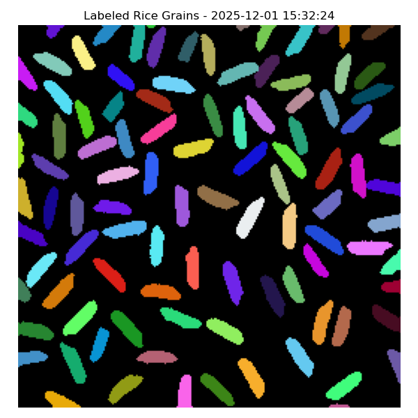
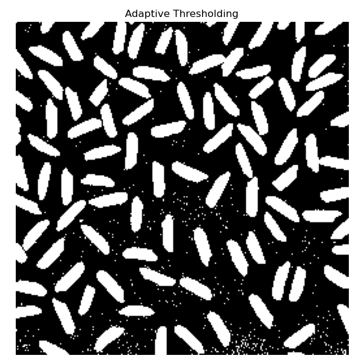
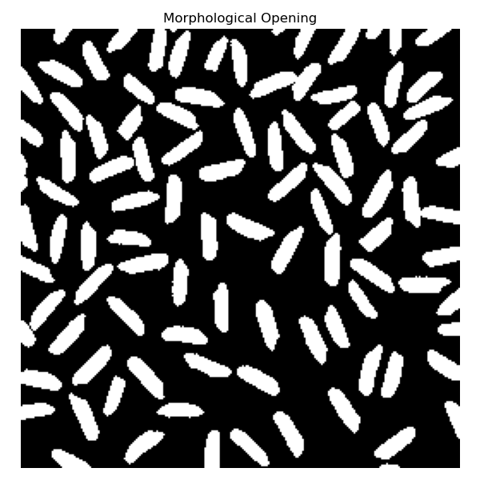
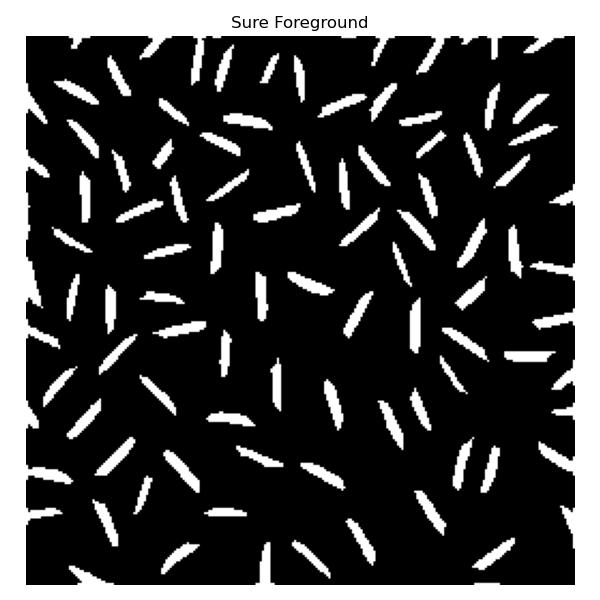
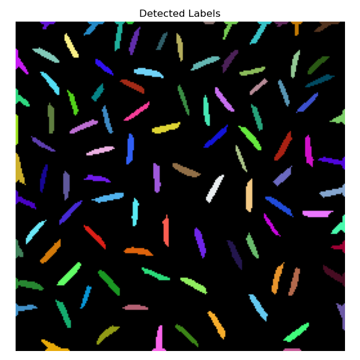
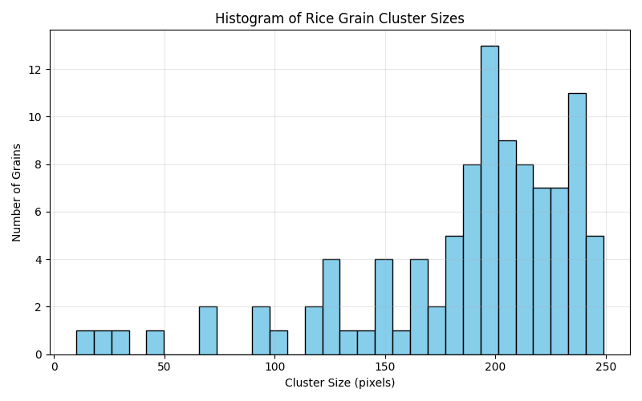

# CIO Programming Test

The goal of this exercise is to understand your approach to solving a task. A perfect result is not required. What matters most is your methodology, clarity, and reproducibility.

## Task
Your task is to count the number of ricecorn in the image `figs/rice.png` and to colour each ricecorn with a unique colour. Then save the colourised result and document how to run your code.


# Solution

Proposed solution from Eric Freiermuth, given the image characteristics, I chose to go with OpenCV and classical computer vision algorithms to preprocess the image and then isolate the individual clusters corresponding to rice grains. A more detailed explanation of the different steps can be found at the end of this `Readme.md`.

## Setup and Run

Open a terminal and run the following commands:

```bash
# Navigate to your project folder
cd /path/to/your/project

# Create a conda environment in the folder and install Python + packages
conda create --prefix ./my_env python=3.12 numpy matplotlib opencv -y

# Activate the environment
conda activate ./my_env

# Run the Rice Counter script
python Rice_Counter_OpenCV.py
```

### Notes:
- Replace `/path/to/your/project` with the actual path where this script is located.  
- After running the script, you can deactivate the environment with:

```bash
conda deactivate
```
- A Jupyter notebook version of the project is also included.  
  To use it, you will need to install the additional packages `jupyter` and `notebook` inside your conda environment.  
  Once installed, you can launch the notebook with `jupyter notebook`, which will automatically open the interface in your web browser.

# Rice Detection Report
<!-- RICE-REPORT-START -->
**Timestamp:** 2025-12-01 15:32:24  
**Rice Count:** 101  
**Detection Report:** All rice grains appear to be detected.  


<!-- RICE-REPORT-END -->

# Method Description

-   After loading the image, the first step is to convert it to
    grayscale, since color does not provide useful information for this
    task.

-   Next, an adaptive threshold is applied to obtain a binary image in
    which each rice grain ideally corresponds to pixels with value
    **1**, while the background corresponds to **0**.\
    I chose adaptive thresholding because I used it during my internship
    and because this image shows a noticeable contrast variation near
    the bottom.



-   To reduce noise introduced by thresholding, a **morphological
    opening** is performed.\
    The structuring element is a small circular kernel within a 3×3
    matrix.\
    Opening consists of an erosion followed by a dilation: the erosion
    removes isolated bright pixels (noise), and the dilation restores
    the shape of larger structures such as rice grains.



-   Although the image is now cleaner, several rice grains remain in
    contact with each other. If we were to apply Connected Component
    Labeling at this stage, touching grains would be counted as a single
    object. To separate them, a **distance transform** is applied.\
    This produces a grayscale image where each pixel's value represents
    its distance to the nearest background pixel.\
    To preserve rice grains at the image boundary, the transform is
    applied to an image with the borders removed.

-   The distance-transformed image is then thresholded to isolate
    individual "peaks," corresponding to the centers of each rice grain.



-   At this stage, **Connected Component Labeling** can be used to
    identify each rice grain as an individual cluster.



-   Finally, a dilation step is applied to recover the grains'
    approximate original shapes for visualization.


## Additional Discussion

- With this approach, we can also obtain statistics on the sizes of the rice grains. This allows us to filter or discard grains whose cluster size is too small, for example.



- Several methods can be used to separate individual grains. I experimented with different approaches, but the most robust solution was applying a distance transform combined with an appropriate threshold value.

